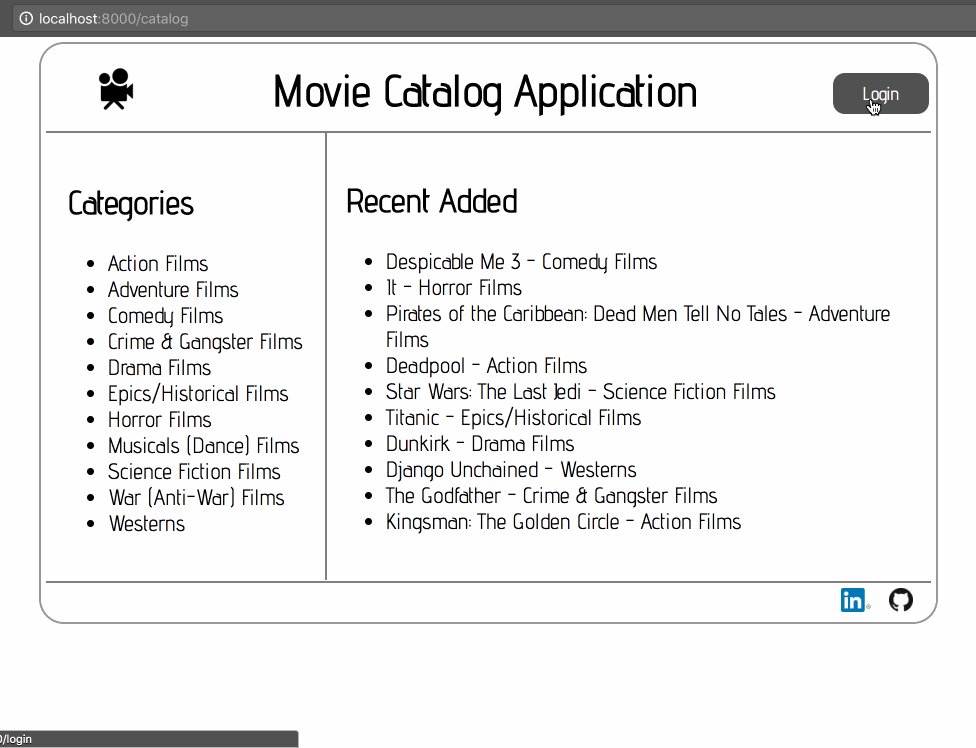
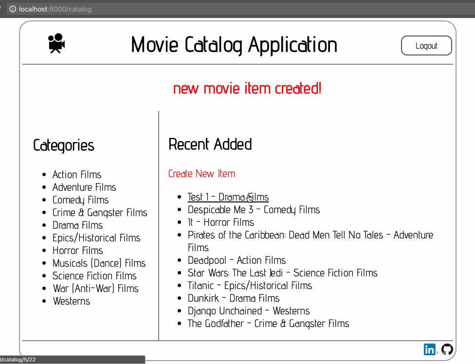
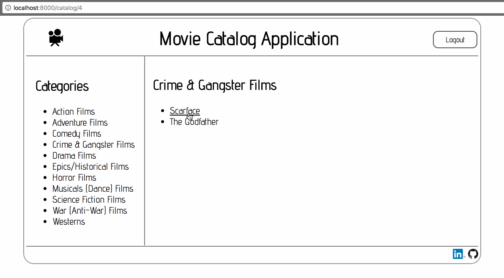
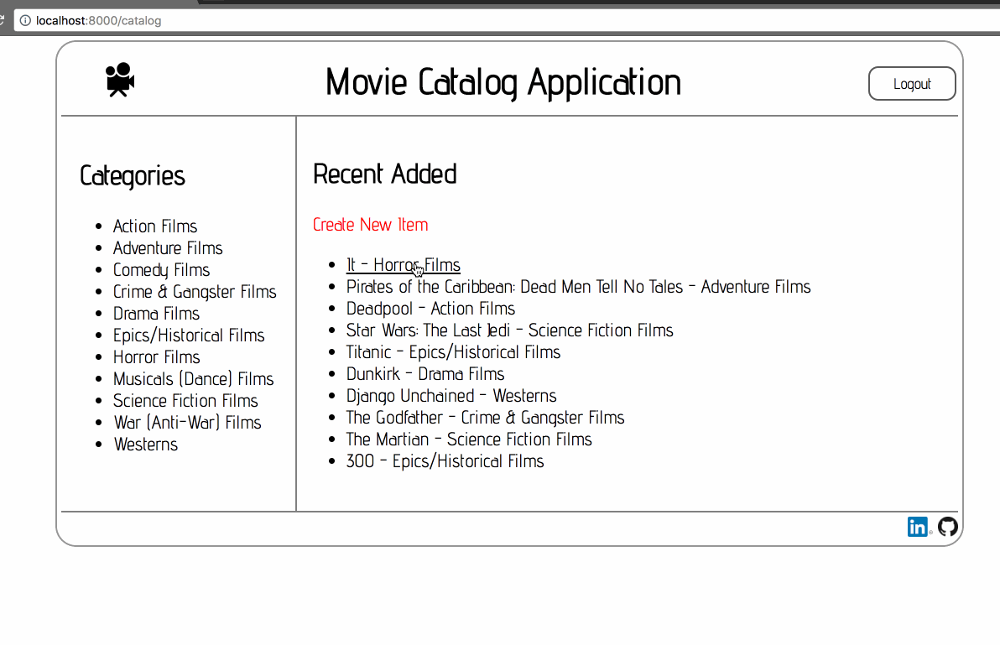

# Item-Catalog-Application
* This application  provides a list of items within a variety of categories as well as provide a user authentication system.  Users will have the ability to post, edit and delete their own items.
> [](Image)

## Getting Started
* You can *[clone](https://github.com/arrickx/Item-Catalog-Application.git)* or *[download](https://github.com/arrickx/Item-Catalog-Application.git)* this project via [GitHub](https://github.com) to your local machine.

### Prerequisites
You will need to install these following application in order to make this code work.
* Unix-style terminal(Windows user please download and use [Git Bash terminal](https://git-scm.com/downloads))
* [VirtualBox](https://www.virtualbox.org/wiki/Downloads)
* [Vagrant](https://www.vagrantup.com/downloads.html)

You will also need to download these following files to make it work.
* [VM configuration](https://d17h27t6h515a5.cloudfront.net/topher/2017/August/59822701_fsnd-virtual-machine/fsnd-virtual-machine.zip)

### Installing

* Unzip the **VM configuration** and you will find a **vagrant** folder
* Use the **Terminal** to get into the **vagrant** folder from **VM configuration**
* run the following command
```sh
$ vagrant up
```
* This will cause Vagrant to download the Linux operating system and install it.
* After it finished and after the shell prompt comes back, you can run this command
```sh
$ vagrant ssh
```
* And this will let you login to the Linux VM. (Please do not shut down the terminal after the login)

### Setting up the enviroment
* Move the folder you downloaded from GitHub and put it into the vagrant folder
* use the following line to get into the vagrant VM folder
```sh
$ cd /vagrant
```
* Use the command line to get in to the folder you just downloaded
* Then you can run this command
```sh
$ python lotsofitems.py
```
* After it added items succesfully, you can run the following command
```sh
$ python project.py
```
* After finish running project.py you can use your favorite browser to visit [this link](http://localhost:8000/)

### How to use
* You can browse through the website to find out the different categories of movies.
> [](Image)
* You can also create you own items after you login.
> [](Image)
* Only the users who created the item have the ability to post, edit, and delete it.
* You can edit an item that you created.
> [](Image)
* You can also delete the item that you created.
> [](Image)
* Once you log out. You can lost your right to change it.
> [](Image)

## License

* This project is licensed under the MIT License - see the [LICENSE](LICENSE) file for details.

## Acknowledgments
* [VM configuration](https://d17h27t6h515a5.cloudfront.net/topher/2017/August/59822701_fsnd-virtual-machine/fsnd-virtual-machine.zip) was provided by [udacity](https://www.udacity.com).
* Movie icon was provided by [iconfinder](https://www.iconfinder.com/icons/351069/camera_film_movie_rolls_video_icon).
